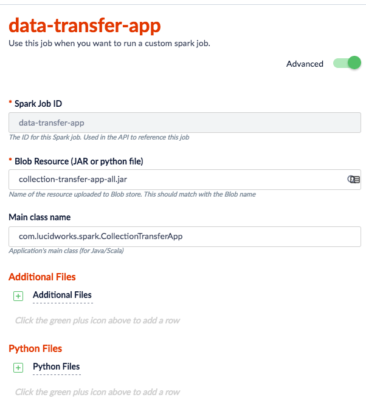
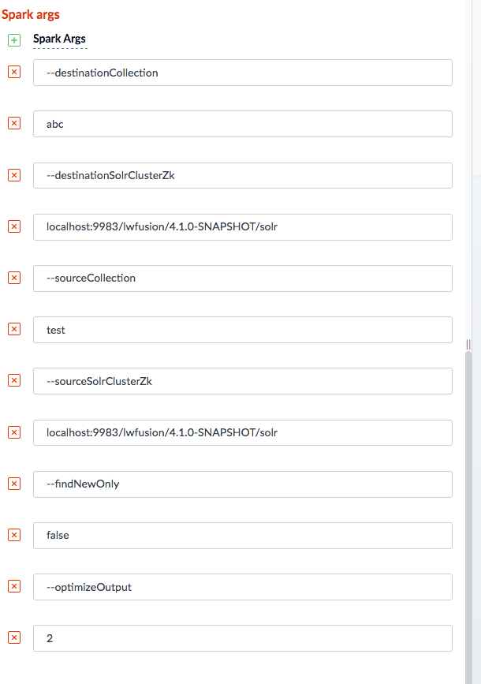

= Fusion Collection Transfer App

Spark submit app for transfering data from one collection to another potentially across clusters.

== Getting Started

You'll need Fusion 3.1.3+

== Run as a Fusion job

_Note: All below actions have to be performed from repo home folder_

* Compile the jar using gradle command `./gradlew clean :collection-transfer-app:shadow`
* Upload the jar to Blob store `./upload_resource.sh collection-transfer-app/build/libs/collection-transfer-app-all.jar`
* Go to 'Jobs' panel in Fusion UI and add a job of type 'Custom Spark Job'
* Add jar name as the blob resource and `com.lucidworks.spark.CollectionTransferApp` as class name (See below screenshot)
* Click on 'Advanced' and add required options to the 'Spark args' section (See below screenshot)

== Options

CollectionTransferApp Options:

[source]
----
--batchSize <arg>                  Batch size for writing docs to the destination cluster; defaults to 10000

--destinationCollection <arg>      Name of the Solr collection on the destination cluster to write data to; uses source name if not provided

--destinationSolrClusterZk <arg>   ZooKeeper connection string for the Solr cluster this app transfers data to

--findNewOnly true|false           Flag to indicate if this app should look for new docs in the source using the latest timestamp in the
                                   destination; defaults to true, set to false to skip this check and pull all docs that match the source query

--sourceCollection <arg>           Name of the Solr collection on the source cluster to read data from

--sourceQuery <arg>                Query to source collection for docs to transfer; uses *:* if not provided

--sourceSolrClusterZk <arg>        ZooKeeper connection string for the Solr cluster this app transfers data from

--sparkConf <arg>                  Additional Spark configuration properties file

--timestampField <arg>             Timestamp field name on docs; defaults to 'timestamp_tdt'

--batchSize <arg>                  Batch size for writing docs to the destination cluster; defaults to 10000

--useNaturalID <arg>               Compute Natural Doc ID by concatenating fields

--optimizeOutput <arg>             Optimize the destination collection to a configured number of segments. Skips optimization if value is zero; Defaults to zero

--splitsPerShard <arg>             Number of splits per shard while reading from Solr

--verbose                          Generate verbose log messages

----
